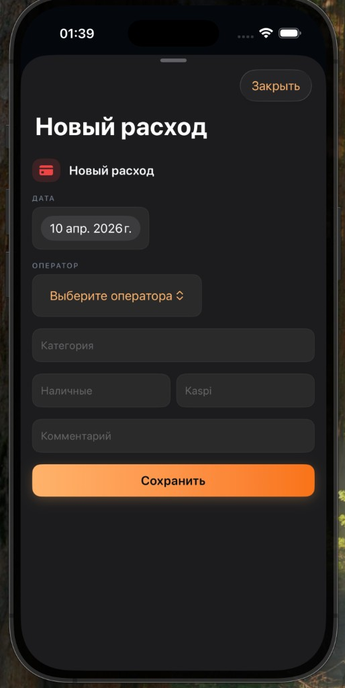
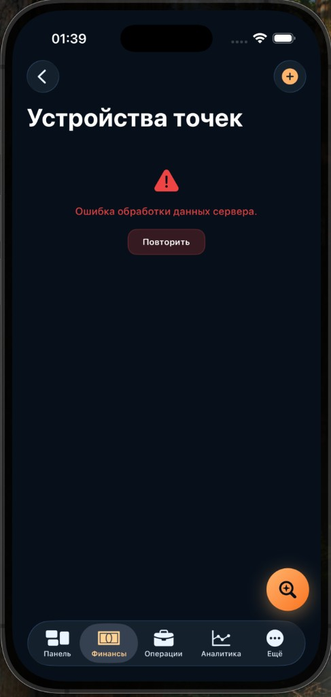

# Скриншоты сессии (проблемы загрузки «Финансы»)

Снимки из симулятора, приложенные к обсуждению **10.04.2026** (порядок как в чате). Файлы лежат в этой же папке; исходники с UUID сохранены у Cursor в `~/.cursor/projects/.../assets/` (имена с отметкой времени `2026-04-10___02.xx.xx`).

| № | Файл | Экран | Основной код в репозитории |
|---|------|--------|---------------------------|
| 1 | `01-new-expense.png` | Новый расход | `Orda Control/Features/Admin/AdminContractsViews.swift` — `AdminExpensesModuleView`, загрузка операторов в `.task` (`loadOperators`), форма создания расхода |
| 2 | `02-new-income.png` | Новый доход | Там же — `AdminIncomesModuleView`, `.task` + `service.loadOperators()` |
| 3 | `03-salary-week.png` | Зарплата (неделя) | `AdminContractsViews.swift` — `AdminSalaryModuleView`; `AdminContractsService.swift` — `loadSalaryWeek(weekStart:)` (`view=weekly`, `ContractEndpoint.api_admin_salary`); `GeneratedContractDTOs.swift` — `SalaryWeekBoard`, `SalaryOperatorRow` |
| 4 | `04-profitability-pl.png` | P&L / рентабельность | `AdminContractsViews.swift` — `AdminProfitabilityView`; `AdminContractsService.swift` — `loadProfitability(from:to:)`; API: `f16finance/app/api/admin/profitability/route.ts` |
| 5 | `05-categories.png` | Категории | `AdminContractsViews.swift` — `AdminCategoriesModuleView`; `AdminContractsService.swift` — `loadCategories()`; API: `f16finance/app/api/admin/categories/route.ts` |
| 6 | `06-salary-rules.png` | Правила зарплаты | `AdminContractsViews.swift` — `AdminSalaryRulesView`, `AdminSalaryRulesRouteView`; `AdminContractsService.swift` — `loadSalaryRules()`; API: `f16finance/app/api/admin/salary-rules/route.ts` |
| 7 | `07-tasks-new-task.png` | Задачи / новая задача | `AdminContractsViews.swift` — `AdminTasksModuleView`; `AdminContractsService.swift` — `loadTasks()`, `createTask` |
| 8 | `08-shifts.png` | Смены | `AdminContractsViews.swift` — `AdminShiftsModuleView`; `AdminContractsService.swift` — `loadShifts(weekStart:)`; API: `f16finance/app/api/admin/shifts/route.ts` |
| 9 | `09-settings-org.png` | Настройки / организация | `Orda Control/Features/Admin/AdminContractsViews.swift` — `AdminSettingsView` (поиск по проекту: `struct AdminSettingsView`) |
| 10 | `10-points-list.png` | Точки | Зависит от точки входа: например `SuperAdminPointsView` в `AdminModuleDirectoryView.swift` (`case .pointsList`) |
| 11 | `11-point-devices-error.png` | Устройства точек (ошибка) | `Orda Control/Features/Admin/AdminPointDevicesView.swift`; `AdminContractsService.swift` — `loadPointDevices()`; модели — `Orda Control/Models/PointDeviceModels.swift`; API: `f16finance/app/api/admin/point-devices/route.ts` |

## Общие точки для сети и ошибок

- Клиент: `Orda Control/Core/Networking/APIClient.swift`, `APIError.swift`
- Сессия и база URL: `Orda Control/Core/Auth/SessionStore.swift`, `AppConfig.swift`
- Хаб модулей (карточки «Доходы», «Расходы», …): `AdminContractsViews.swift` — `AdminContractsHubView`

Превью в Markdown (локально в IDE):

